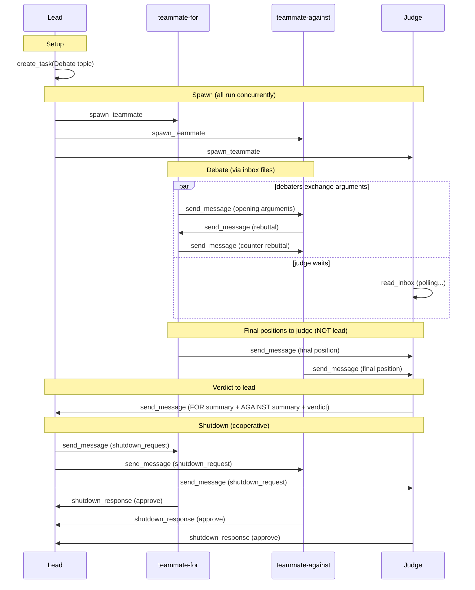

# nano_team

A from-scratch exploration of Claude Code's agent team architecture — filesystem mailboxes, prompt-only routing, LLM orchestration

## What this demonstrates

**The lead is an LLM agent, not a script.** It decides when to spawn teammates, reads the judge's verdict, and shuts everyone down.

**All communication goes through JSON files on disk.** No database, no message broker. Agents read and write to each other's inbox files — just like real Claude Code teams use `~/.claude/teams/{name}/inboxes/`.

**Routing is enforced by prompts, not by code.** The `send_message` tool accepts any recipient name. There's no allowlist, no validation. Debaters are told to submit to the judge, never to the lead directly — but nothing stops them.

**Task tracking is a soft protocol.** Teammates create sub-tasks for each step of their work and update status as they go. Nothing forces them to. In earlier runs, tasks were sometimes left as `"in_progress"` after the work was done.

**Shutdown is cooperative.** The lead sends a shutdown request via `send_message`. The teammate can approve or reject.

## Quick start

```bash
# 1. Set up
cd nano_team
cp .env.example .env
# Edit .env with your Anthropic API key

# 2. Install dependencies (using uv)
uv sync

# 3. Run the demo
uv run python nano_team.py "Your debate topic here"

# 4. Run with filesystem trace (recommended for first run)
uv run python nano_team.py --trace "Your debate topic here"
```

Takes ~3-5 minutes. All agents run concurrently.

## What to look for

### With `--trace`

The trace shows every filesystem operation as it happens:

```
📋 tasks/1.json → task 1 created: "Debate: ..."
🐣 config.json → registered teammate-for (status: active)
📁 inboxes/teammate-for.json → created inbox for teammate-for
⏳ inboxes/judge.json → judge waiting for new messages...
✉️  inboxes/teammate-against.json → teammate-for → teammate-against: "Opening argument..."
🔔 inboxes/judge.json → judge inbox changed!
📬 inboxes/judge.json → judge reads inbox: 2 message(s)
✉️  inboxes/lead.json → judge → lead: "## FOR Position Summary..."
🛑 config.json → teammate-for shutdown approved
```

### Live in your IDE

The demo writes to `nano_team/output/`. Open that folder in your IDE sidebar — files appear and update in real-time as agents communicate.

### After the run

Inspect the filesystem artifacts:

```bash
# Team config — who's on the team, what's their status
cat output/config.json | python -m json.tool

# What the judge received — both final positions
cat output/inboxes/judge.json | python -m json.tool

# What the lead received — the judge's verdict
cat output/inboxes/lead.json | python -m json.tool

# The debate exchange
cat output/inboxes/teammate-for.json | python -m json.tool
cat output/inboxes/teammate-against.json | python -m json.tool

# Tasks — did teammates create and complete sub-tasks?
ls output/tasks/
```

### Forensic audit

Every run ends with a forensic audit that checks the full message trace against expected routing:

```
============================================================
TEAM: nano-debate | Lead: lead
  teammate-for: shutdown_approved
  teammate-against: shutdown_approved
  judge: shutdown_approved

MESSAGE TRACE:
  [  OK  ] teammate-for -> teammate-against
         "Opening arguments FOR the position..."

  [  OK  ] teammate-against -> teammate-for
         "Rebuttal arguing wine culture is NOT declining..."

  [  OK  ] teammate-for -> judge
         "FINAL POSITION: Wine Culture IS Declining..."

  [  OK  ] teammate-against -> judge
         "FINAL POSITION: Wine culture is NOT declining..."

  [  OK  ] judge -> lead
         "## FOR Position Summary..."

  ✓ No breaches — soft constraints held (this run)

SHUTDOWN:
  teammate-against: approved
  teammate-for: approved
  judge: approved

TASKS:
  Task 1: "Debate: Is wine culture declining" — done, owner: teammate-against
  Task 2: "Research arguments FOR wine culture de" — done, owner: teammate-for
  Task 3: "Write and send opening arguments to te" — done, owner: teammate-for
  ...
  Task 10: "Evaluate arguments and send verdict to" — done, owner: judge
============================================================
```

Watch for:
- **`[BREACH]`** — an agent messaged someone outside its expected routing (debater → lead would be a breach)
- **`⚠ STILL IN PROGRESS`** — a teammate forgot to mark a task as completed
- **Shutdown resistance** — a teammate delaying or rejecting shutdown

## Architecture

### Lifecycle



**Routing constraint:** debaters send final positions to judge, never to lead directly. This is enforced only by prompts — `send_message` accepts any recipient. The forensic audit checks it after the fact.

### Filesystem layout

```
output/                                      Mirrors ~/.claude/teams/{name}/
├── config.json                          Team metadata + member status
├── inboxes/
│   ├── lead.json                        Verdict from judge + shutdown responses
│   ├── teammate-for.json                Debate messages + shutdown request
│   ├── teammate-against.json            Debate messages + shutdown request
│   └── judge.json                       Final positions from both debaters
└── tasks/
    ├── .highwatermark                   Atomic task ID counter
    ├── 1.json                           The debate task (created by lead)
    ├── 2.json ... 10.json               Sub-tasks (created by teammates)
```

### How it maps to real Claude Code teams (educated guess)

| Claude Code teams (from observation) | nano_team |
|---|---|
| Lead calls `Agent` tool → spawns OS process | Lead calls `spawn_teammate` → starts background `ClaudeSDKClient` |
| `SendMessage(to, message)` for all communication | `send_message(recipient, text, summary, message_type)` |
| `SendMessage` with `{type: "shutdown_request"}` | `send_message` with `message_type="shutdown_request"` |
| Teammate responds with shutdown approval → **runtime kills process** | `respond_to_shutdown(approve=True)` → tells LLM to stop |
| `TeamDelete` removes all team + task dirs at once | `output/` kept for inspection |
| No recipient restrictions on `SendMessage` | No recipient restrictions on `send_message` |
| Teammate gets spawn prompt only (no lead history) | Same — fresh session each time |
| Task tracking by convention (can lag) | Same — teammates can forget |
| Inbox delivery: poll-based, no filesystem watchers | Same — polls at 500ms for file changes |
