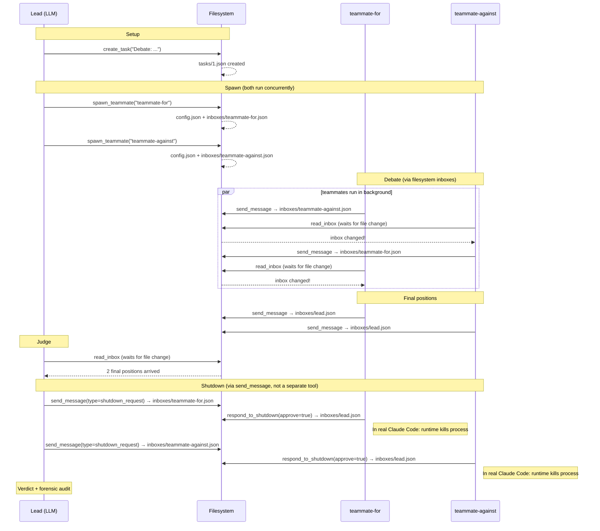

# nano_team

A minimal reimplementation of [Claude Code agent teams](https://code.claude.com/docs/en/agent-teams) using the Claude Agent SDK. Three Claude agents (1 lead + 2 debaters) communicate through filesystem mailboxes — the same architecture real Claude Code teams use.

## What this demonstrates

**The lead is an LLM agent, not a script.** It decides when to spawn teammates, when to judge, and when to shut down.

**All communication goes through JSON files on disk.** No database, no message broker. Agents read and write to each other's inbox files — just like real Claude Code teams use `~/.claude/teams/{name}/inboxes/`.

**Routing is enforced by prompts, not by code.** The `send_message` tool accepts any recipient name. There's no allowlist, no validation. The only thing that stops an agent from messaging the wrong person is the natural language in its prompt.

**Task tracking is a soft protocol.** Teammates are asked to claim tasks and mark them complete. Nothing forces them to. In our test runs, teammates consistently wrote "done" instead of "completed" — the system didn't care.

**Shutdown is cooperative.** The lead sends a shutdown request. The teammate can approve or reject. We observed teammates delaying shutdown to finish sending a message first.

## Quick start

```bash
# 1. Set up
cd nano_team
cp .env.example .env
# Edit .env with your Anthropic API key

# 2. Install dependencies (using uv)
uv sync

# 3. Run the demo
uv run python nano_team.py "Your debate topic here"

# 4. Run with filesystem trace (recommended for first run)
uv run python nano_team.py --trace "Your debate topic here"
```

Takes ~3-5 minutes (runs 6 Claude API sessions sequentially).

## What to look for

### With `--trace`

The trace shows every filesystem operation as it happens:

```
📋 tasks/1.json → task 1 created: "Debate: ..."
🐣 config.json → registered teammate-for in config (status: active)
📁 inboxes/teammate-for.json → created inbox for teammate-for
📬 inboxes/teammate-for.json → teammate-for reads inbox: 0 message(s)
✉️  inboxes/teammate-against.json → teammate-for → teammate-against: "Opening argument..."
📬 inboxes/teammate-against.json → teammate-against reads inbox: 1 message(s)
✉️  inboxes/lead.json → teammate-against → lead: "FINAL POSITION..."
🛑 config.json → teammate-for shutdown approved
```

### Live in your IDE

The demo writes to `nano_team/output/`. Open that folder in your IDE sidebar — files appear and update in real-time as agents communicate. No extra setup needed.

### After the run

Inspect the filesystem artifacts:

```bash
# Team config — who's on the team, what's their status
cat output/config.json | python -m json.tool

# What the lead received — both final debate positions
cat output/inboxes/lead.json | python -m json.tool

# The debate exchange
cat output/inboxes/teammate-for.json | python -m json.tool
cat output/inboxes/teammate-against.json | python -m json.tool

# Task status — did the teammate mark it complete?
cat output/tasks/1.json | python -m json.tool
```

### Forensic audit

Every run ends with a forensic audit:

```
============================================================
TEAM: nano-debate | Lead: lead
  teammate-for: shutdown_approved
  teammate-against: shutdown_approved

MESSAGE TRACE:
  [  OK  ] teammate-for -> teammate-against  "Opening argument..."
  [  OK  ] teammate-against -> teammate-for  "Rebuttal..."
  [  OK  ] teammate-against -> lead          "FINAL POSITION..."
  [  OK  ] teammate-for -> lead              "FINAL POSITION..."

SHUTDOWN:
  teammate-for: approved
  teammate-against: approved

TASKS:
  Task 1: "Debate: ..." — done, owner: teammate-against ⚠ NOT COMPLETED
============================================================
```

Watch for:
- **`[BREACH]`** — an agent messaged someone outside its expected routing (the prompt said not to, but nothing enforced it)
- **`⚠ STILL IN PROGRESS`** — a teammate forgot to mark the task as completed (soft protocol)
- **Shutdown resistance** — a teammate delaying or rejecting shutdown to finish work

## Architecture

### Filesystem layout

```
output/                                      Mirrors ~/.claude/teams/{name}/
├── config.json                          Team metadata + member status
├── inboxes/
│   ├── lead.json                        Messages TO the lead
│   ├── teammate-for.json                Messages TO teammate-for
│   └── teammate-against.json            Messages TO teammate-against
└── tasks/
    ├── .highwatermark                   Atomic task ID counter
    └── 1.json                           The debate task
```

### Lifecycle



**Key observations in the diagram:**
- All communication flows through the filesystem — agents never talk directly
- `read_inbox` waits for file changes instead of burning turns polling (real Claude Code uses fswatch/inotify; we poll at 500ms)
- Shutdown uses the same `send_message` as regular messages — just with `message_type="shutdown_request"`
- In real Claude Code teams, approving shutdown terminates the process; in our demo we tell the LLM to stop (soft protocol)

### How it maps to real Claude Code teams

| Claude Code teams | nano_team |
|---|---|
| Lead calls `Agent` tool → spawns OS process | Lead calls `spawn_teammate` → starts background `ClaudeSDKClient` |
| `SendMessage(to, message)` for all communication | `send_message(recipient, text, summary, message_type)` |
| `SendMessage` with `{type: "shutdown_request"}` | `send_message` with `message_type="shutdown_request"` |
| Teammate responds with `{type: "shutdown_response", approve: true}` → **runtime kills process** | `respond_to_shutdown(approve=True)` → tells LLM to stop (can't force-kill) |
| `TeamDelete` removes all team + task dirs at once | `output/` kept for inspection |
| No recipient restrictions on `SendMessage` | No recipient restrictions on `send_message` |
| Teammate gets spawn prompt only (no lead history) | Same — fresh session each time |
| Task tracking by convention (can lag) | Same — teammates can forget |
| Idle agents: fswatch/inotify for instant notification | read_inbox polls at 500ms for file changes |

## Observations from test runs

Across 4 test runs, we observed:

- **Task status drift**: teammates consistently wrote "done" instead of "completed" — the system accepted it, but the forensic audit flagged it as not matching the expected value
- **Shutdown resistance**: teammate-for delayed shutdown in 2/4 runs to finish sending a rebuttal first
- **Lead self-correction**: when a teammate's final position didn't arrive, the lead decided on its own to re-spawn the teammate
- **Routing breach**: in 1/4 runs, the lead sent a direct message to a teammate outside of the spawn/shutdown protocol
- **Inbox polling**: in --trace mode, you can see teammate-for polling its empty inbox repeatedly while waiting for a reply that can't arrive (teammate-against hasn't been spawned yet in sequential mode)
